# Getting started

To quickly start with Open Integration Engine, also called OIE in this documentation, 
you can use the different installers available on Windows, Mac OS and Linux platforms.

::: tip INFORMATION

All installers are available at the release page on GitHub, see [GitHub Release](https://github.com/OpenIntegrationEngine/engine/releases)

The installers are available in 2 flavors:

* With Java Runtime Environment (JRE) 
* Without JRE
:::


## System requirements

The OIE Server operates as a completely self-contained application and does not depend on any external application server.

### Java requirements

The Open Integration Engine requires Java 17+ to work

::: warning
OIE can work with older versions of Java, but this is not recommended, 
as some extensions may require version 17 to function correctly.
:::

### Database requirements

OIE comes with the Derby database by default, which allows you to store configuration and messages, for the purpose of rapid deployment, development and testing.

However, during a production deployment, it is recommended to use one of the following database engines:

* PostgreSQL and above
* MySQL 8.0 and above
* MariaDB 10.11 and above
* Oracle 18c and above
* SQL Server 2019 and above

## Download and installation

You can download the latest version of Open Integration Engine for your platform at this 
[address](https://github.com/OpenIntegrationEngine/engine/releases/latest).


### Windows

::: info
Add Screenshots for windows Installation
:::

### Mac OS

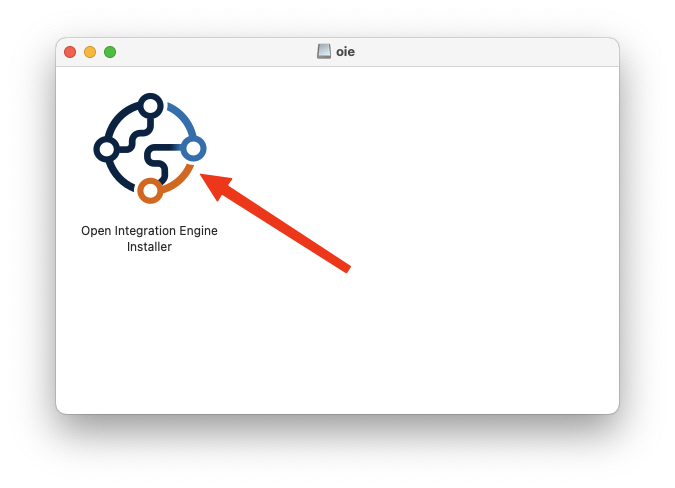

Double-click to launch the Open Integration Engine Installer

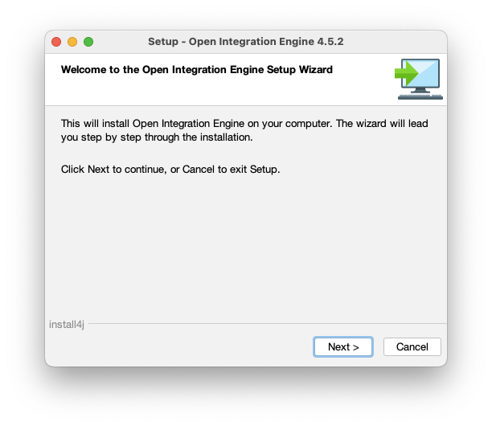

The welcome screen just resumes the information, just click on `Next`

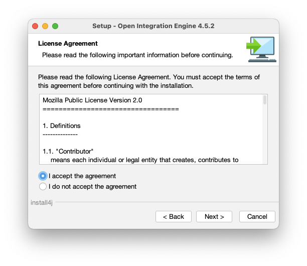

This screen displays the license, to continue you must accept this license by check `I accept the agreement`
and after click on `Next`

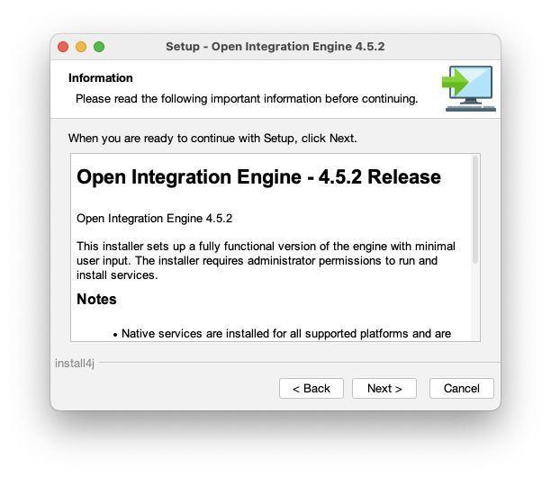

Read this screen information and click on `Next`to continue.

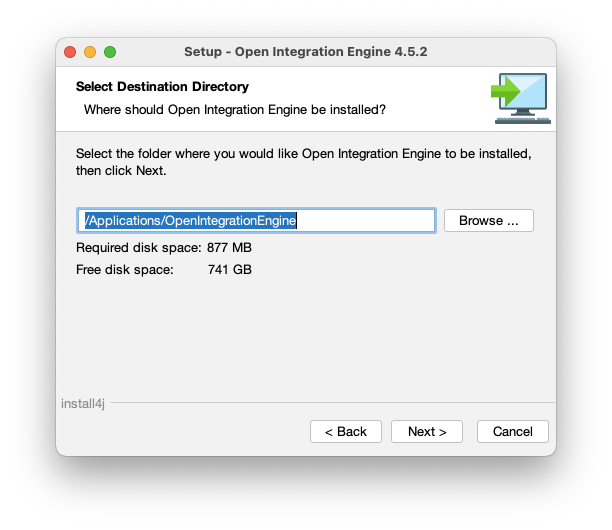

You can choose another folder if you do not want to install as global package.

::: warning
If you let the default application folder, to launch the oie server, you need to use `sudo` command.
:::

And click on `Next` to start the installation.

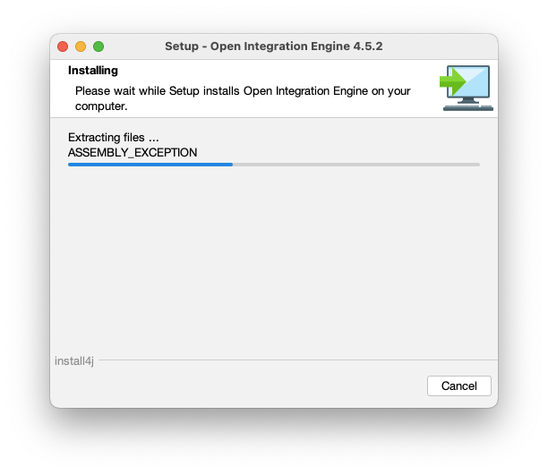


You can display the progress of the installation with this screen

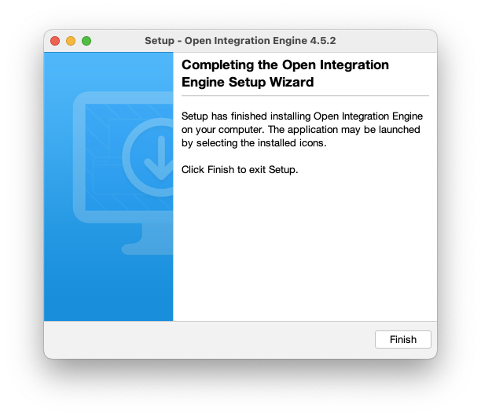

This is the final screen of the installer, just click on Finish to close the installer wizard.

Now, open a Terminal and start the OIE server

```shell
sudo /Applications/OpenIntegrationEngine/oieserver
```

The first time, the server creates the default database. If server is launched correctly, you shoud see. the following lines:

```shell
INFO  2026-01-15 20:07:38.773 [Main Server Thread] com.mirth.connect.server.Mirth: Open Integration Engine 4.5.2 (Built on July 8, 2025) server successfully started.
INFO  2026-01-15 20:07:38.776 [Main Server Thread] com.mirth.connect.server.Mirth: This product was developed by NextGen Healthcare (https://www.nextgen.com) and its contributors (c)2005-2024.
INFO  2026-01-15 20:07:38.776 [Main Server Thread] com.mirth.connect.server.Mirth: Open Integration Engine contributors (c)2025.
INFO  2026-01-15 20:07:38.777 [Main Server Thread] com.mirth.connect.server.Mirth: Running OpenJDK 64-Bit Server VM 17.0.15 on Mac OS X (15.7.3, aarch64), derby, with charset UTF-8.
INFO  2026-01-15 20:07:38.778 [Main Server Thread] com.mirth.connect.server.Mirth: Web server running at http://192.168.1.X:8080/ and https://192.168.1.X:8443/
```

::: tip
Please note these URLs, as we will need them later.
:::

### Linux


## First launch

To verify if the OIE server is available, open your web browser and enter the URL previously noted.

After confirmed to accept self signed certificate, you will see this page

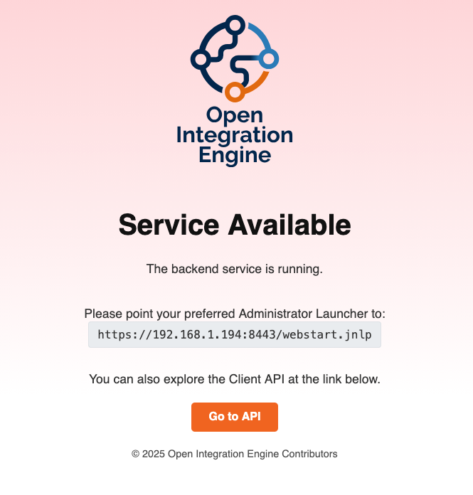

Copy the Administrator Launcher URL

### Ballista

[Ballista](https://github.com/kayyagari/ballista/releases) is the web-based administration interface for Open Integration Engine based on Tauri.

### MCAL

The original Mirth Connect Administrator Launcher works with OIE, you can use it.

Go to the Mac Os Launcher and search Mirth, you will see this icon.

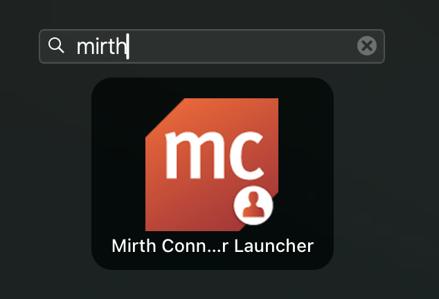

If it's the first launch, the left panel with connections is empty

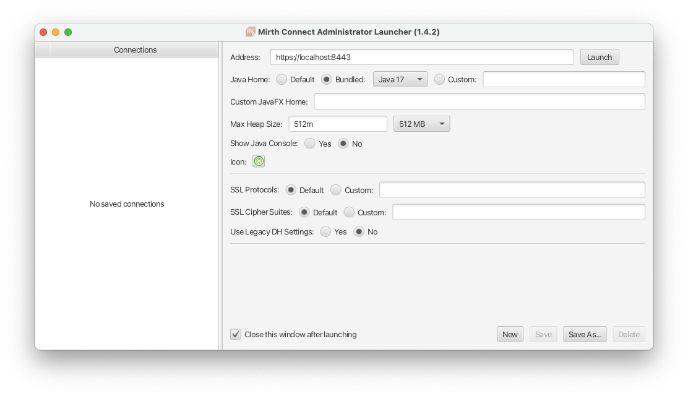

To work better with OIE, choose `Bundled Java 17`

And just click on `Launch` at the top right screen.

You should see a progress bar that will load the files necessary to launch the Open Integration Engine client.

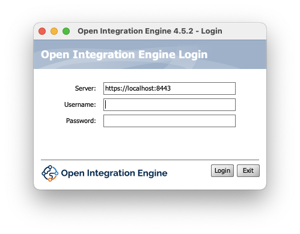

::: warning

If you use a new instance, the defaults credentials are:

* login: **admin**
* password: **admin**
:::

After entering your credentials, click on `Login` button.

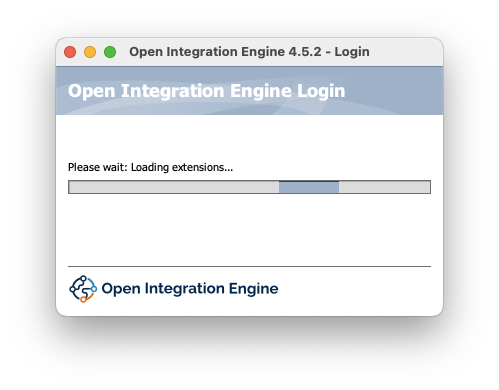

After some time, you will see the OIE dashboard.

Now it asks to change the default password

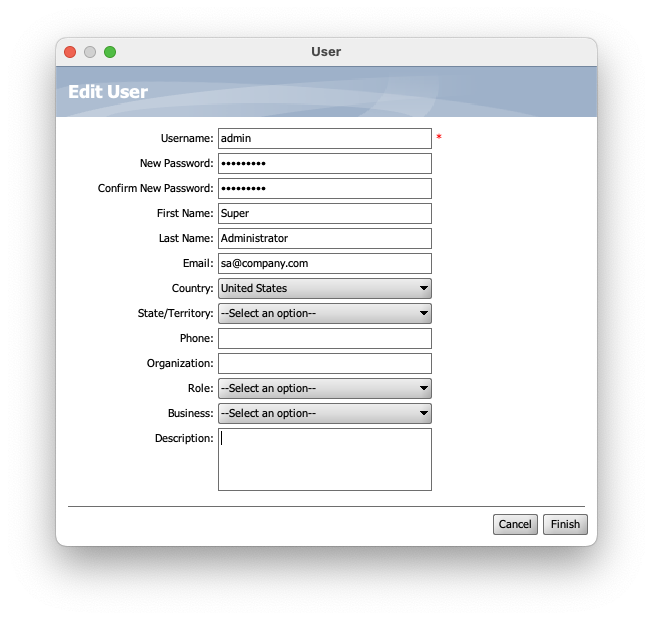

Fill the information, and don't forget to set the `New Password` ( 2 times)

And click on `Finish`

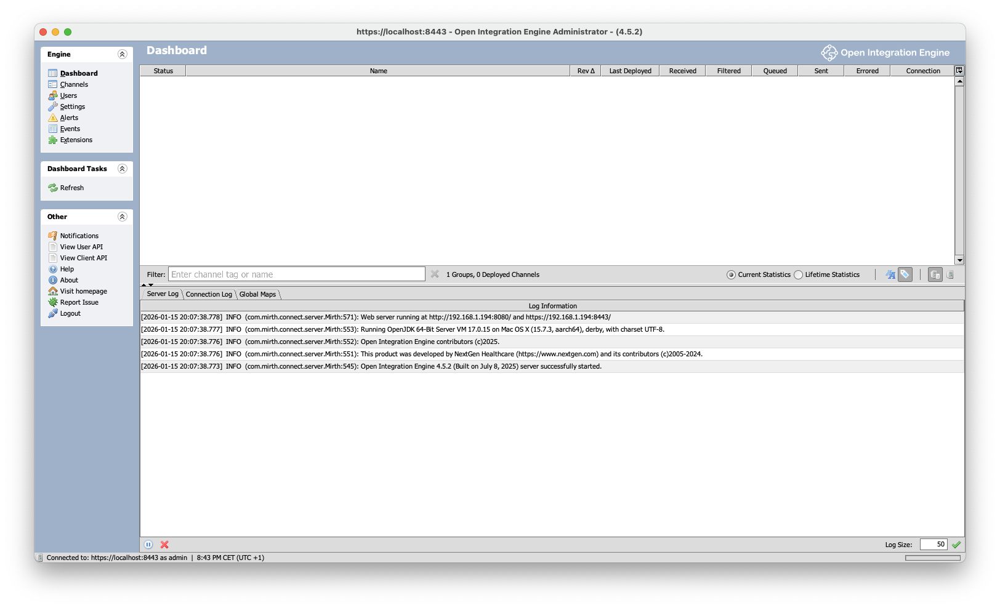

It's finished, now you can start to use OIE server,